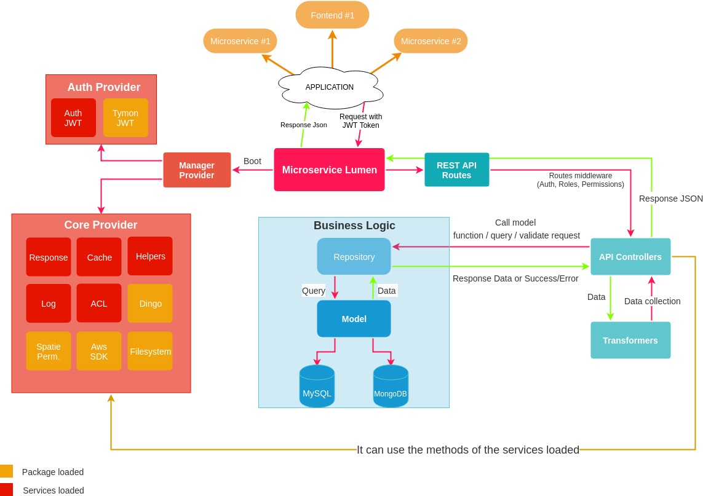

# DevOps Microservice Lumen Project
[build] [stable]

[version] [v1.2.0  beta]

##### Why use it?
>Microservice Lumen allows you to start from a solid foundation to build your backend. Using packages, services and patterns you'll be able to implement your app in an easy and efficient way. With this framework you can build your REST API in a few steps using artisan commands to create the Controller, the Repository linked to the data model and the Trasformer for data display. The microservice communicates with the outside through HTTP API calls with JWT authentication (stateless token). It implements base services for API controller, response and helpers.

## Official Documentation
[wiki] [https://github.com/FabrizioCafolla/microservice-lumen/wiki]

## Features 

**Doker** to start the application with `Nginx`, `PHP 7`, `MySQL` and `Redis`;

**JWT** for the authentication of routes usable with the implemented service;

**Services** implemented to facilitate work:

    -Api helpers function
    -Response method to manage error/success/exceptions responses
    -Auth for manage user and jwt token
    -ACL method for manipulate user roles and permissions
    -Log method to manage file log
    -Cache implements methods to manage File and Redis cache with serialization
    
**Roles and Permissions** to assign them to users and manage routes with greater security;

**Repository pattern** implemented to manage the models in an abstract way and to allow the scalability of the business logic (used to guarantee also the code cleaning)

**Transformer** classes to manipulate data and better manage the recovery of related information (are transformed through functions implemented in ApiService)
  
**Artisan commands** to create Repository, ApiController, Provider and Transoformers (Other commands to create example file view documentation)

  ##### v1.2.0 beta
    -Changed many names and parameters of methods
    -Remove Dingo package
    -Fixed Respose service and add errorException function
    -Add json response in handler exception
    -Fixed Auth service
    
  ##### v1.1.6 beta
    -Creative methods to manage Transformers
    -Fixed Response service
    -Delete Helpers service
    
  ##### v1.1.5 beta
    -Restyling Auth service
    -Fixed auth controller
    -Fixed service provider
    
  ##### v1.1.4 beta
    -Restyling Response service
    -Fixed composer require
    -Fixed service app make
    
  ##### v1.1.3 beta
    -Fixed service alias
    -Add manager service provider with config
    -Create command to create provider
    
  ##### v1.1.2 beta
    -Create external package for Cache and require
    -Fixed App and Auth providers
    -Fixed boostrap file load
    
  ##### v1.1.1 beta
    -Fixed ResponseService success method
    -Fixed transform and give method
    -Fixed AbstractCache with serialization method
    -Install aws sdk

## License

This project is open-sourced software licensed under the [MIT license](http://opensource.org/licenses/MIT)
